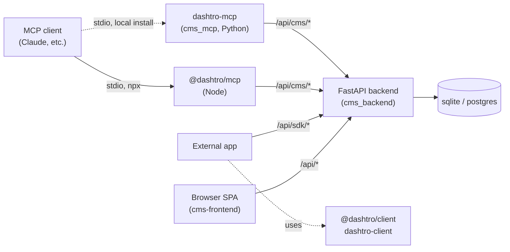

# Dashtro

[](https://github.com/1atharvad/dashtro/actions/workflows/build-image.yml)
[](https://github.com/1atharvad/dashtro/pkgs/container/dashtro)
[](https://www.npmjs.com/package/@dashtro/client)
[](LICENSE)

A self-hosted CMS with a project → workspace → collection → document model, a
FastAPI backend, and a React/TypeScript frontend. Ships as a single Docker
image, published to `ghcr.io/1atharvad/dashtro`. This repo only builds and
publishes that image — running it in production (nginx, tunnel/domain
routing, etc.) is owned by the consuming project (e.g. the portfolio site
that embeds Dashtro as its admin/CMS backend).

## Contents

- [Structure](#structure)
- [Packages](#packages)
- [Architecture](#architecture)
- [Data backends](#data-backends)
- [Running locally (dev)](#running-locally-dev)
- [Running the image elsewhere](#running-the-image-elsewhere)
- [Environment variables](#environment-variables)
- [Backup / restore CLI](#backup--restore-cli)
- [CI/CD](#cicd)
- [Tests](#tests)

## Structure

| Path | What it is |
| --- | --- |
| [`cms_backend/`](cms_backend/) | FastAPI backend — API, auth, schema engine, data clients. See its [README](cms_backend/README.md). |
| [`cms-frontend/`](cms-frontend/) | React + TypeScript + Vite frontend. See its [README](cms-frontend/README.md). |
| [`cms_mcp/`](cms_mcp/) | MCP server exposing Dashtro operations to MCP-compatible clients (Python, console script `dashtro-mcp`, direct database access). |
| [`sdk/js/`](sdk/js/) | `@dashtro/client` — JS/TS client SDK for `/api/sdk/*`. |
| [`sdk/python/`](sdk/python/) | `dashtro-client` — Python client SDK for `/api/sdk/*`, released in lockstep with `sdk/js/`. |
| [`sdk/mcp/`](sdk/mcp/) | `@dashtro/mcp` — npx-runnable MCP server (Node/TS port of `cms_mcp/`) for consuming projects; talks to `/api/cms/*` over HTTP, no Python required. |
| [`nginx/`](nginx/) | Reverse proxy config for local dev only. |

## Packages

Everything this repo publishes, and what it's for:

| Package | Registry | Install | What it's for |
| --- | --- | --- | --- |
| `ghcr.io/1atharvad/dashtro` | [GHCR](https://github.com/1atharvad/dashtro/pkgs/container/dashtro) | `docker pull ghcr.io/1atharvad/dashtro` | The CMS itself — backend + built frontend in one image. See [Running the image elsewhere](#running-the-image-elsewhere). |
| [`@dashtro/client`](sdk/js/) | [npm](https://www.npmjs.com/package/@dashtro/client) | `npm install @dashtro/client` | JS/TS client SDK for `/api/sdk/*` — read/write a project's documents and RTDB from an external app. |
| [`dashtro-client`](sdk/python/) | [PyPI](https://pypi.org/project/dashtro-client/) | `pip install dashtro-client` | Python equivalent of `@dashtro/client`, released in lockstep with it. |
| [`@dashtro/mcp`](sdk/mcp/) | npm (not yet published) | `npx @dashtro/mcp init` | npx-runnable MCP server — lets Claude/other MCP clients read and write your CMS content. Node port of `cms_mcp/`, no Python needed. |
| `dashtro` | not published | n/a — run from a repo checkout | Root package: the `dashtro` backup/restore CLI (`cms_backend/scripts/cms_schema.py`) and the Python MCP server (`cms_mcp/`, console script `dashtro-mcp`). Not on PyPI — use `@dashtro/mcp` instead for MCP access, or run this from a checkout for the backup CLI. |

## Architecture



Everything ultimately talks to the same FastAPI backend — the frontend over
its own API, external apps over the API-key-scoped `/api/sdk/*` surface (via
either client SDK), and MCP clients over `/api/cms/*` through either MCP
server (`@dashtro/mcp` for a zero-install `npx` setup, or `cms_mcp`/`dashtro-mcp`
if you're already in a Python environment with direct database access).

## Data backends

`DB_TYPE` selects the storage backend, defaulting to `sqlite`:

- `sqlite` — single-file DB, zero external dependencies. Default.
- `postgres` — set `DB_HOST`/`DB_PORT`/`DB_NAME`/`DB_USER`/`DB_PASSWORD`. An optional
  bundled `postgres` compose service is available (see below) if you don't want to
  point at an external instance.

Both backends implement the same interface (`get_data_client()` / `get_auth_client()` /
`get_audit_client()` in `cms_backend/api/utils/__init__.py`), so routers don't change
depending on which one is active.

## Running locally (dev)

Hot-reloading, separate frontend/backend containers, Cloudflare tunnel support:

```bash
cp .env.example .env   # fill in real values
npm run dev             # docker compose -f docker-compose.dev.yml up --build
npm run dev:down
```

Optional local Postgres instead of an external one:

```bash
docker compose -f docker-compose.dev.yml --profile postgres up
```

## Running the image elsewhere

The published image serves both the API and the built SPA on port 7312, and
reads its config from env vars (see below) — no other dependency beyond
whichever `DB_TYPE` backend you point it at:

```yaml
dashtro:
  image: ghcr.io/1atharvad/dashtro:latest
  environment:
    JWT_SECRET_KEY: ...
    CORS_ORIGINS: ...
    CMS_PUBLIC_URL: ...
    DB_TYPE: sqlite
    # ...see .env.example for the full list
  volumes:
    - uploads_data:/app/uploads
```

Put it behind whatever reverse proxy/tunnel the consuming project already
uses to route a subdomain (e.g. `admin.example.com`) to it.

## Environment variables

See [`.env.example`](.env.example) for the full list (`DB_TYPE`, `JWT_SECRET_KEY`,
`CORS_ORIGINS`, `CMS_PUBLIC_URL`, etc.).

## Backup / restore CLI

`cms_backend/scripts/cms_schema.py` (installed as the `dashtro` console script)
exports/imports schemas, documents, and media to/from a `backup/` directory.

### Local (direct database access)

```bash
# Export
dashtro export schema --project-id <id>
dashtro export documents --project-id <id> --workspace <name>
dashtro export media

# Import
dashtro import schema --project-id <id>
dashtro import documents --project-id <id> --workspace <name>
dashtro import media
```

Run against a running container:

```bash
docker exec <container> dashtro export schema --project-id <id> --backup-dir /app/backup
docker exec <container> dashtro import schema --project-id <id> --backup-dir /app/backup
```

### Remote (HTTP API with authentication)

Use `--base-url` to export/import from/to a remote Dashtro instance. Requires an API key generated in the CMS settings.

**Via command line:**

```bash
# Export from remote
dashtro export schema --project-id <id> --base-url https://your-cms.com --api-key <api-key>
dashtro export documents --project-id <id> --workspace <name> --base-url https://your-cms.com --api-key <api-key>
dashtro export media --base-url https://your-cms.com --api-key <api-key>

# Import to remote
dashtro import schema --project-id <id> --base-url https://your-cms.com --api-key <api-key>
dashtro import documents --project-id <id> --workspace <name> --base-url https://your-cms.com --api-key <api-key>
dashtro import media --base-url https://your-cms.com --api-key <api-key>
```

**Via environment variable (recommended):**

```bash
export CMS_API_KEY=<api-key>
dashtro export schema --project-id <id> --base-url https://your-cms.com
dashtro import documents --project-id <id> --workspace <name> --base-url https://your-cms.com
```

### Full backup/restore workflow

Export must run in order: schema → documents → media. Restore uses the same order:

```bash
# Backup from source instance
dashtro export schema --project-id abc123 --base-url https://source.com --api-key <key>
dashtro export documents --project-id abc123 --workspace production --base-url https://source.com --api-key <key>
dashtro export media --base-url https://source.com --api-key <key>

# Restore to destination instance
dashtro import schema --project-id abc123 --base-url https://dest.com --api-key <key>
dashtro import documents --project-id abc123 --workspace production --base-url https://dest.com --api-key <key>
dashtro import media --base-url https://dest.com --api-key <key>
```

**Options:**

| Flag | Meaning |
| --- | --- |
| `--backup-dir` | Backup directory location (default: `./backup/`) |
| `--base-url` | Remote API URL (if omitted, uses direct database access) |
| `--api-key` | API key for authentication (or set `CMS_API_KEY` env var) |
| `--merge` | Merge documents instead of replacing (local mode only) |

## CI/CD

[`.github/workflows/build-image.yml`](.github/workflows/build-image.yml) runs
on every push to `main` (or manually via `workflow_dispatch`):

1. **`lint`** — frontend `npm run lint` + backend `isort`/`black`/`ruff --check`. Must pass before anything builds.
2. **`build-and-push`** — builds `Dockerfile.dashtro`, pushes to `ghcr.io/1atharvad/dashtro` tagged `latest` and the commit SHA.

That's it — this repo doesn't deploy anywhere itself. Whatever consumes the
image (e.g. the portfolio project) is responsible for pulling and running it.

## Tests

```bash
cd cms_backend && pytest              # backend, SQLite by default
TEST_DB_TYPE=postgres pytest          # backend, against a reachable Postgres

cd cms-frontend && npm test           # frontend (vitest)
```

## License

[MIT](LICENSE)
